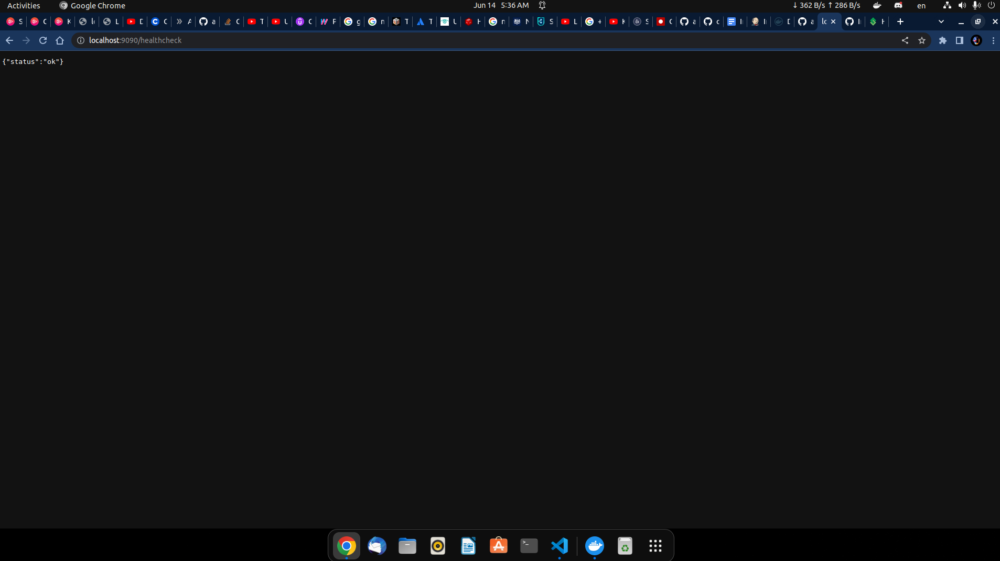
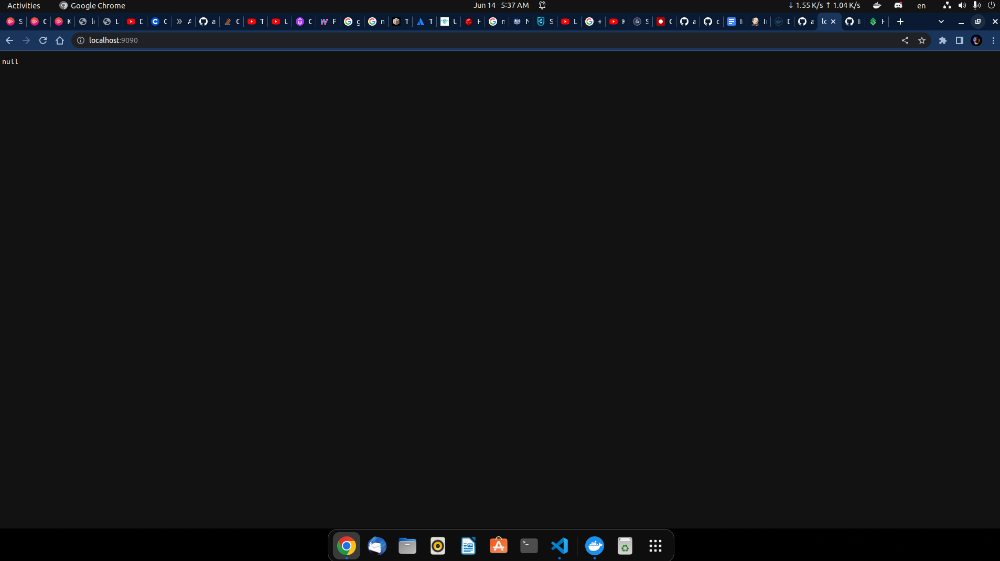
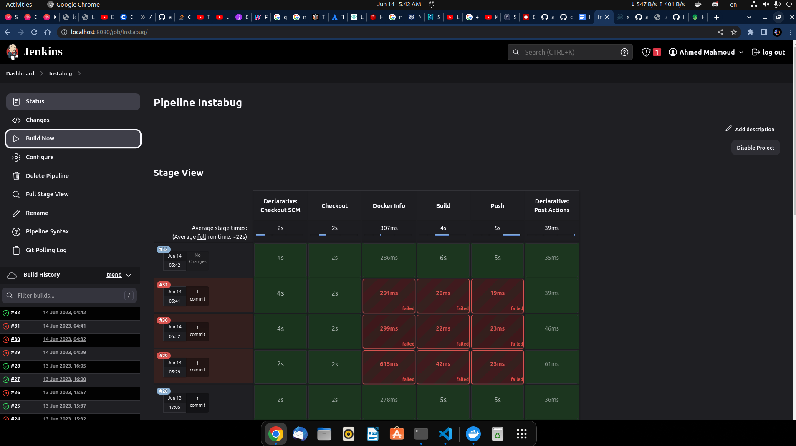

# Wow Such Program

This program is very simple, it connects to a MySQL database based on the following env vars:

* MYSQL_HOST (defaults to `localhost`)
* MYSQL_USER (defaults to `root`)
* MYSQL_PASS (defaults to `1234`)
* MYSQL_PORT (defaults to `3306`)

you can run it with `go run main.go` or build it with `go build` and run the binary.
you can also use the provided `docker-compose.yml` file to run it with `docker-compose up`.

specify the autoscaling parameters in the ./Helm Chart/values.yaml 
choose the suitable env environment in the dockercompose.yml

And exposes itself on port 9090:
* On `/healthcheck` it returns an OK message, 
* On GET it returns all recorded rows.
* On POST it creates a new row.
* On PATCH it updates the creation date of the row with the same ID as the one specified in query parameter `id`

 
 
